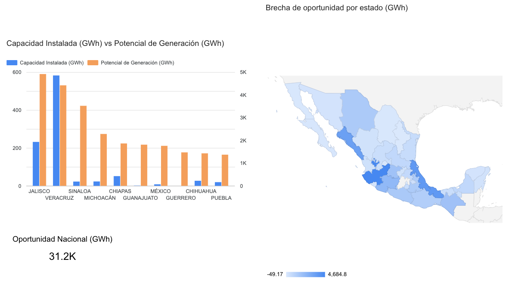
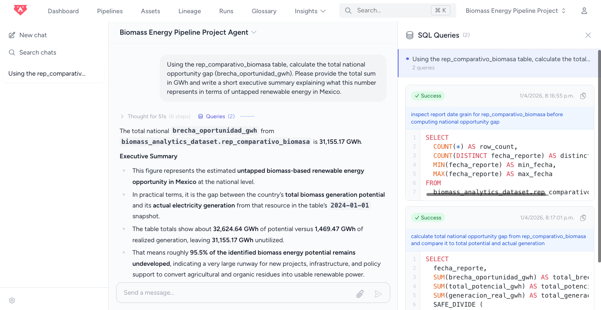
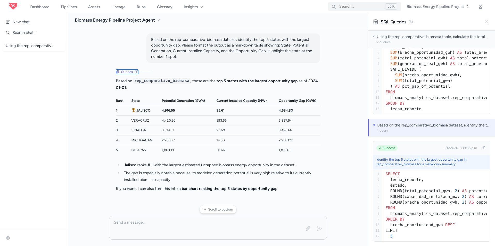
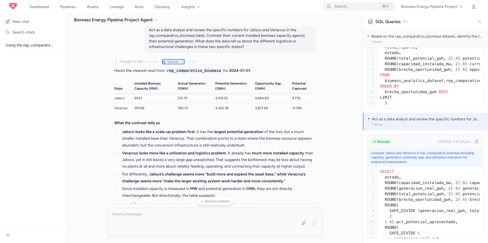
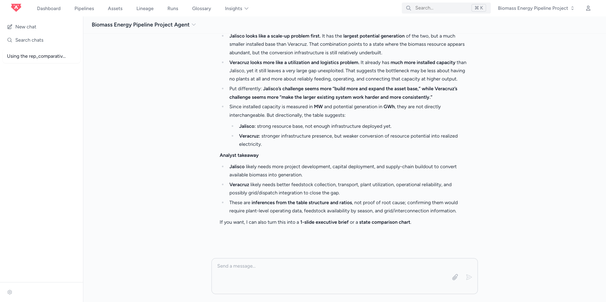
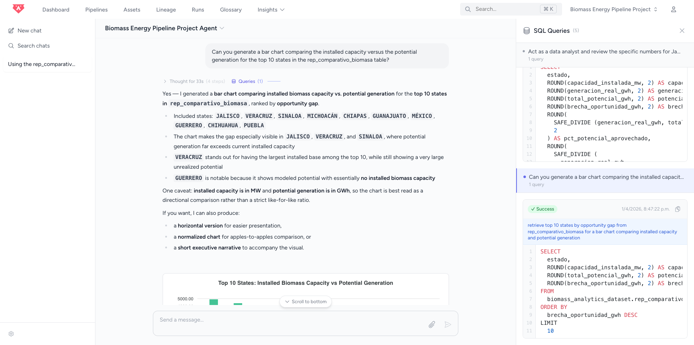
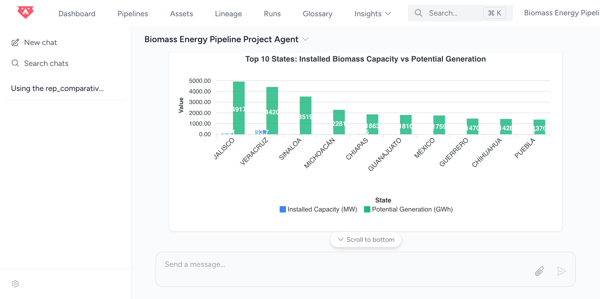

# Part 1: Problem Description and Cloud

## 1. Problem Description

**Context:** Biomass energy, derived from organic waste such as agricultural residues (e.g., sugarcane bagasse, corn stover), represents a massive but underutilized renewable energy source in Mexico. Efficient biomass power generation relies heavily on logistics: power plants must be geographically close to the raw material sources to be profitable and sustainable. 

**The Problem:** Currently, there is a significant data gap for renewable energy investors and policymakers in Mexico. The information required to identify optimal locations for new biomass plants is highly fragmented across different government entities. 
1. Agricultural production data (raw material potential) is isolated in the SIAP (Agri-Food and Fisheries Information Service) databases.
2. Installed clean energy capacity data is buried in historical archives from SEMARNAT/INEL, as primary energy portals often aggregate biomass alongside fossil fuels under generic "thermoelectric" labels.

Because these datasets live in silos, use different geographical naming conventions, and lack a unified architecture, it is nearly impossible to visualize the "untapped potential"—the states that generate millions of tons of agricultural waste but have zero installed biomass energy capacity.

**The Solution:** This project builds an automated, cloud-based batch data pipeline to solve this fragmentation. The pipeline extracts raw agricultural data and installed energy capacity data from their respective public sources, cleans and standardizes the geographical dimensions, and loads them into a centralized Data Warehouse. 

The final deliverable is an analytical dashboard that contrasts **Installed Biomass Capacity vs. Raw Material Potential** by state. This provides a clear, data-driven map of the untapped geographical potential for new biomass power plants in Mexico.

## 2. Cloud & Infrastructure as Code (IaC)

This project is fully developed in the cloud. The infrastructure, consisting of a Data Lake and a Data Warehouse, is hosted on **Google Cloud Platform (GCP)**. To ensure reproducibility and follow best practices, the infrastructure was provisioned using **Terraform** as our Infrastructure as Code (IaC) tool.

The deployment process was executed through the following 5 steps:

### Step 1: Verification

First, we verified that Terraform was correctly installed on the local machine (macOS) to execute the provisioning commands:

```bash
terraform -version
```

### Step 2: Authentication

To allow Terraform to interact securely with GCP, we granted temporary access to the local terminal using Google's Application Default Credentials (ADC):

```bash
gcloud auth application-default login
```

### Step 3: Defining Variables (`variables.tf`)

To avoid hardcoding and keep the project dynamic, we declared our project ID, region, and resource names in a variables file. 

*(Note: Sensitive information, such as the specific GCP Project ID, has been replaced with the placeholder `YOUR_PROJECT_ID` in this public repository).*

```hcl
variable "project" {
  description = "GCP Project ID"
  default     = "YOUR_PROJECT_ID"
  type        = string
}

variable "region" {
  description = "Region for the resources"
  default     = "us-central1"
  type        = string
}

variable "location" {
  description = "General geographic location for BigQuery and Cloud Storage"
  default     = "US"
  type        = string
}

variable "bq_dataset_name" {
  description = "BigQuery Dataset Name"
  default     = "biomass_analytics_dataset"
  type        = string
}

variable "gcs_bucket_name" {
  description = "Cloud Storage Bucket Name"
  default     = "data-lake-biomass-YOUR_PROJECT_ID"
  type        = string
}
```

### Step 4: Resource Creation (`main.tf`)

We wrote the declarative code to provision the required architecture:

1. **Data Lake:** A Google Cloud Storage (GCS) Bucket to hold the raw agricultural and energy data. We enforced `uniform_bucket_level_access` to comply with GCP security constraints.
2. **Data Warehouse:** A Google BigQuery dataset where the analytical transformations will take place.

```hcl
terraform {
  required_providers {
    google = {
      source  = "hashicorp/google"
      version = "5.6.0"
    }
  }
}

provider "google" {
  project = var.project
  region  = var.region
}

# Data Lake Creation (Google Cloud Storage)
resource "google_storage_bucket" "data-lake-bucket" {
  name                        = var.gcs_bucket_name
  location                    = var.location
  force_destroy               = true
  uniform_bucket_level_access = true 

  lifecycle_rule {
    condition {
      age = 1
    }
    action {
      type = "AbortIncompleteMultipartUpload"
    }
  }
}

# Data Warehouse Creation (Google BigQuery)
resource "google_bigquery_dataset" "dataset" {
  dataset_id = var.bq_dataset_name
  location   = var.location
}
```

### Step 5: Deployment

Finally, the infrastructure was brought to life in the cloud by executing the standard Terraform workflow in the terminal:

1. `terraform init`: Initialized the working directory and downloaded the Google Cloud provider plugins.
2. `terraform plan`: Generated an execution plan, showing the 2 resources to be created.
3. `terraform apply`: Confirmed and executed the plan, successfully provisioning the Data Lake and Data Warehouse in GCP.

# Part 2: Bruin End-to-End ELT Pipeline (Data Ingestion, Data Warehouse, and Transformations)

To manage the data lifecycle of this project, I designed an end-to-end **ELT (Extract, Load, Transform)** batch pipeline. Instead of juggling multiple disjointed tools (e.g., Airflow for orchestration and dbt for transformations), I used **Bruin**, a unified modern data platform. 

This single-tool architecture efficiently covers three major course requirements:

* **3. Data Ingestion (Batch / Workflow Orchestration):** Bruin orchestrates an end-to-end DAG. It uses Python assets to extract historical agricultural and energy data from Mexican government sources (SIAP and SENER) and loads the raw data directly into our Google Cloud Storage (GCS) Data Lake.
* **4. Data Warehouse:** The data is stored and processed in Google BigQuery. To optimize analytical queries and reduce processing costs, the final tables are strategically **partitioned** (by year/date) and **clustered** (by State/Geography), which makes perfect sense for geospatial and temporal biomass analysis.
* **5. Transformations:** Bruin serves as a powerful alternative to dbt. I built a multi-layered SQL architecture (`staging` for cleaning and `reports` for business logic) where Bruin automatically infers dependencies, builds the execution DAG, and runs the transformations directly inside BigQuery.

Our pipeline follows a strict 4-step roadmap:
1. **Configuration** (Cloud auth & Orchestration rules)
2. **Ingestion Layer** (Extracting to GCS)
3. **Staging Layer** (Cleaning raw data in BigQuery)
4. **Reports Layer** (Applying biomass conversion logic and DWH optimization)

## Step 1: Pipeline Configuration (Cloud Connection & Orchestration)

Before writing any data extraction logic, the first step was to establish a secure bridge between the local Bruin environment and the GCP infrastructure provisioned via Terraform, as well as defining the pipeline's operational rules.

### 1. Global Cloud Connection (`.bruin.yml`)
To allow Bruin to interact with BigQuery and Google Cloud Storage securely, I configured the global `.bruin.yml` file located at the root of the Bruin directory. I created a dedicated Service Account in GCP (`gcp-biomasa`) with the necessary Admin permissions and linked its JSON key.

```yaml
# .bruin.yml
default_environment: default
environments:
  default:
    connections:
      google_cloud_platform:
        - name: "gcp-biomass"
          service_account_file: "/path/to/secure/credentials.json"
          project_id: "biomass-energy-491402"
```

### 2. Orchestration Rules (`pipeline.yml`)
Inside the specific pipeline folder, I created the `pipeline.yml` file. This acts as the brain of the workflow, dictating *when* and *how* the pipeline runs. Because we are performing a **Batch load** of historical data, we set a static `start_date` and a `daily` schedule. 

```yaml
# pipeline/pipeline.yml
name: biomass-pipeline
schedule: "daily"
start_date: "2020-01-01"
default_connections:
  google_cloud_platform: "gcp-biomass"
```

To ensure the connection was solid before writing any code, I ran the `bruin validate .` command in the terminal. The dry-run validation passed successfully (`No issues found`), confirming that the syntax was correct and the authentication with Google Cloud Platform was fully operational.

## Step 2: Ingestion Layer

*(Note: In the code blocks below, sensitive/specific project identifiers like the GCP Bucket name have been replaced with generic placeholders such as `<YOUR_BUCKET_NAME>`. Remember to replace them with your actual configuration before running the code).*

The goal of this layer is to perform the **Extract** and **Load** phases of our ELT pipeline. We pull raw agricultural and energy data directly from Mexican government endpoints (SIAP and SEMARNAT) and load it into our Google Cloud Storage (GCS) Data Lake. 

Since BigQuery cannot natively read external `.xls` or `.xlsx` files, we implemented an in-memory transformation using `pandas` to convert legacy Excel formats into standard `.csv` files before uploading them to the cloud. This avoids saving temporary files on the local machine.

### 1. Folder Structure and Dependencies

First, we created an `ingestion/` directory inside the `assets/` folder. Inside this new folder, we created a `requirements.txt` file. Bruin reads this file to create an isolated environment during execution.

**`assets/ingestion/requirements.txt`**

```text
requests
google-cloud-storage
urllib3
pandas
openpyxl
xlrd
```

* `requests` and `urllib3`: To handle HTTP requests and suppress SSL warnings from outdated government certificates.
* `google-cloud-storage`: To interact with our Data Lake.
* `pandas`, `openpyxl`, `xlrd`: To process and convert legacy `.xls` and `.xlsx` files in memory.

To prevent linter errors in VS Code and test locally, we also installed these packages in our local virtual environment:

```bash
pip install requests google-cloud-storage urllib3
pip install pandas openpyxl xlrd
```

### 2. The Python Asset

Next, we created the `biomass_ingest.py` script. This asset contains the Bruin metadata header to define the execution environment and the Python logic to fetch, optionally convert, and upload the data.

**`assets/ingestion/biomass_ingest.py`**

```python
""" @bruin
name: biomass_ingestion
type: python
image: python:3.11
@bruin """

import requests
from google.cloud import storage
import urllib3
import pandas as pd
import io

# Suppress SSL warnings from government websites with outdated certificates
urllib3.disable_warnings(urllib3.exceptions.InsecureRequestWarning)

def upload_to_gcs(bucket_name, destination_blob_name, content):
    """
    Uploads a file directly to Google Cloud Storage from RAM.
    """
    storage_client = storage.Client()
    bucket = storage_client.bucket(bucket_name)
    blob = bucket.blob(destination_blob_name)
    
    blob.upload_from_string(content)
    print(f"Success: File loaded to gs://{bucket_name}/{destination_blob_name}")

def main():
    # TODO: Replace with your actual GCS Bucket name
    bucket_name = "<YOUR_BUCKET_NAME>" 
    
    # Dictionary containing the extraction rules and URLs for each source
    fuentes = {
        "raw_siap_agricola_2024": {
            "url": "https://nube.agricultura.gob.mx/index.php?view=10AE434F-A2158368-A120BC5A-EDF4AFAA&ANIO=2024",
            "type": "csv"
        },
        "raw_siap_diccionario": {
            "url": "https://nube.agricultura.gob.mx/index.php?view=5D24F995-E734D711-1EA6F8D2-9D1387D7",
            "type": "excel",
            "engine": "openpyxl", # Engine for modern .xlsx
            "sheet": 0,           # First sheet
            "skiprows": 13        # Skip government report headers
        },
        "raw_semarnat_capacidad": {
            "url": "https://apps1.semarnat.gob.mx:8443/dgeia/compendio_2020/archivos/02_energia/d2_energia03_05.xls",
            "type": "excel",
            "engine": "xlrd",     # Engine for legacy .xls
            "sheet": "Indicador", # Target sheet
            "skiprows": 2         # Skip report headers
        }
    }

    for nombre_archivo, info in fuentes.items():
        print(f"Downloading {nombre_archivo}...")
        
        url_real = info["url"]
        response = requests.get(url_real, verify=False) 
        
        if response.status_code == 200:
            # Enforcing .csv extension for all files
            ruta_destino = f"raw/{nombre_archivo}.csv" 
            
            if info["type"] == "csv":
                upload_to_gcs(bucket_name, ruta_destino, response.content)
            elif info["type"] == "excel":
                print(f"  Transforming Excel to CSV in-memory...")
                excel_data = io.BytesIO(response.content)
                
                df = pd.read_excel(
                    excel_data, 
                    engine=info["engine"], 
                    sheet_name=info["sheet"], 
                    skiprows=info["skiprows"]
                ).ffill()
                
                csv_string = df.to_csv(index=False, encoding='utf-8')
                upload_to_gcs(bucket_name, ruta_destino, csv_string)
        else:
            print(f"Error {response.status_code} while downloading {nombre_archivo}")

if __name__ == "__main__":
    main()
```

### 3. Execution and Cloud Verification

To run the ingestion process, we executed the following Bruin command in the terminal from the project's root directory:

```bash
bruin run --environment default assets/ingestion/biomass_ingest.py
```

Bruin automatically provisioned a temporary Python environment, installed the dependencies from `requirements.txt`, and executed the code. 

**Verification:** By navigating to the GCP Console -> Cloud Storage -> Buckets -> `<YOUR_BUCKET_NAME>`, we successfully verified the automatic creation of the `raw/` virtual directory containing our three files (`raw_siap_agricola_2024.csv`, `raw_siap_diccionario.csv`, and `raw_semarnat_capacidad.csv`), perfectly formatted and ready for the Staging Layer.

## Step 3: Staging Layer

*(**Note for reproducibility:** In the SQL snippets below, sensitive data such as specific GCP Project IDs and Cloud Storage Bucket names have been replaced with generic placeholders like `<YOUR_PROJECT_ID>`, `<YOUR_DATASET>`, and `<YOUR_BUCKET_NAME>`. If you are replicating this project, please update these values with your actual GCP configuration).*

With the raw data successfully ingested into our Data Lake (Google Cloud Storage), the next step in our ELT pipeline is the **Staging Layer**. 

The main objective of this layer is **Technical Transformation**. We are not applying business logic or complex math yet; instead, we are preparing the ground by standardizing string formats, correcting data types (Type Casting), handling null values, and solving structural issues from the raw files. This ensures that downstream analytical queries in the Data Warehouse are reliable and performant.

To organize our pipeline, we created a new directory structure: `assets/staging/` to hold our BigQuery SQL assets.

### 1. The Bridge: Creating External Tables (`1_create_external_tables.sql`)

Before BigQuery can transform the data, it needs to be able to "see" the CSV files sitting in Cloud Storage. We achieve this by creating **External Tables**. These tables do not store data internally; they act as pointers to our Data Lake.

Since this is a Data Definition Language (DDL) operation rather than a standard `SELECT` query, we omitted the `materialization` block in the Bruin metadata.

```sql
/* @bruin
name: create_external_tables
type: bq.sql
depends:
  - biomass_ingestion
@bruin */

-- 1. External Table for SIAP (Agricultural Data)
CREATE OR REPLACE EXTERNAL TABLE `<YOUR_PROJECT_ID>.<YOUR_DATASET>.ext_siap`
OPTIONS (
  format = 'CSV',
  uris = ['gs://<YOUR_BUCKET_NAME>/raw/raw_siap_agricola_2024.csv'],
  skip_leading_rows = 1, -- Ignores the header text to prevent CASTing errors downstream
  encoding = 'ISO_8859_1' -- Preserves Spanish characters (ñ, accents) from the Mexican gov data
);

-- 2. External Table for SEMARNAT (Energy Capacity Data)
CREATE OR REPLACE EXTERNAL TABLE `<YOUR_PROJECT_ID>.<YOUR_DATASET>.ext_semarnat`
OPTIONS (
  format = 'CSV',
  uris = ['gs://<YOUR_BUCKET_NAME>/raw/raw_semarnat_capacidad.csv'],
  skip_leading_rows = 1,
  encoding = 'UTF8'
);
```
*We had to execute this file individually first (`bruin run ... 1_create_external_tables.sql`) so the tables physically existed in GCP, allowing subsequent `bruin validate` commands for downstream models to pass.*

### 2. SIAP Data Cleaning (`stg_siap_agricola.sql`)

With the bridge established, we created our first Native Table in BigQuery. This asset reads from the external table, casts the production volume to mathematical decimals (`FLOAT64`), and heavily standardizes the geographical columns using `UPPER(TRIM())`. This standardization is critical to guarantee perfect table joins later.

```sql
/* @bruin
name: <YOUR_DATASET>.stg_siap_agricola
type: bq.sql
materialization:
  type: table
depends:
  - create_external_tables
@bruin */

SELECT
    CAST(Anio AS INT64) AS anio,
    UPPER(TRIM(Nomestado)) AS estado,
    UPPER(TRIM(Nommunicipio)) AS municipio,
    UPPER(TRIM(Nomcultivo)) AS cultivo,
    CAST(Volumenproduccion AS FLOAT64) AS toneladas_produccion,
    CAST(Cosechada AS FLOAT64) AS hectareas_cosechadas
FROM `<YOUR_PROJECT_ID>.<YOUR_DATASET>.ext_siap`
WHERE Volumenproduccion IS NOT NULL;
```

### 3. SEMARNAT Data Cleaning (`stg_semarnat_capacidad.sql`)

The raw energy data presented two major Data Quality challenges that required engineering solutions:

1. **The Merged Cells Issue (Solved in Ingestion):** The original Excel file used merged cells for State names. When converted to CSV, secondary rows lost their state label. We solved this retroactively in Step 2 by adding a Pandas `.ffill()` (forward fill) method during ingestion to propagate the State names downward.
2. **Schema-on-Read Sanitization:** BigQuery enforces strict naming conventions (no spaces or accents). When it read our raw headers (e.g., `Tipo de energía limpia`), it automatically sanitized them into machine-readable strings (e.g., `Tipo_de_energ__a_limpia`). We embraced this Schema-on-Read approach by querying the ugly auto-generated names and aliasing them into a clean, professional schema.

In this script, we also filtered strictly for 'BIOMASA' and excluded subtotal rows (`!= 'TOTAL'`) to prevent data duplication.

```sql
/* @bruin
name: <YOUR_DATASET>.stg_semarnat_capacidad
type: bq.sql
materialization:
  type: table
depends:
  - create_external_tables
@bruin */

SELECT
    UPPER(TRIM(Entidad_federativa)) AS estado,
    UPPER(TRIM(Tipo_de_energ__a_limpia)) AS tipo_energia,
    CAST(Establecimientos AS INT64) AS cantidad_plantas,
    CAST(Capacidad_instalada__MW_ AS FLOAT64) AS capacidad_instalada_mw,
    CAST(Generaci__n__GWh_a_ AS FLOAT64) AS generacion_gwh
FROM `<YOUR_PROJECT_ID>.<YOUR_DATASET>.ext_semarnat`
WHERE UPPER(TRIM(Tipo_de_energ__a_limpia)) = 'BIOMASA'
  AND UPPER(TRIM(Entidad_federativa)) != 'TOTAL';
```

### 4. Validation, Deployment, and GCP Verification

Bruin acts as a robust orchestrator. Thanks to the `depends:` metadata blocks, it inherently understands the lineage of our pipeline.

We validated our SQL syntax and schema logic using:
```bash
bruin validate
```
Once everything passed successfully, we deployed the entire Staging Layer to the cloud:
```bash
bruin run --environment default assets/staging/
```

**BigQuery Verification:**

Navigating to the GCP Console, we successfully verified that:

* The Native Tables (`stg_siap_agricola` and `stg_semarnat_capacidad`) were created.
* **The Schemas** were correct (production volumes and megawatt capacities are now recognized natively as `FLOAT` and `INTEGER`, not `STRING`).
* **The Data** was pristine: State names are in perfect uppercase with no trailing spaces, nulls are handled, and only Biomass facilities remain.

**Preamble to Step 4:**

With clean, numeric, and geographically standardized datasets residing inside our Data Warehouse, the foundation is set. We are now ready to move to the **Reports Layer**, where we will perform cross-table joins and apply the mathematical formulas required to convert agricultural tons into MWh, ultimately comparing installed capacity vs. potential generation.

## Step 4: Reports Layer (Applying Biomass Conversion Logic and DWH Optimization)

*Note: In the SQL snippets provided below, specific Google Cloud Project IDs and dataset names have been replaced with generic placeholders (e.g., `<YOUR_PROJECT_ID>.<YOUR_DATASET>`) for security and reusability.*

The Reports Layer is the analytical core of this ELT pipeline. In this stage, we transition from raw agricultural tonnage to potential electrical energy (GWh/a) and compare it against the actual installed capacity reported by the government. 

To achieve this, we developed two highly optimized SQL models in Bruin, implementing complex mathematical transformations and Data Warehouse optimization techniques.

### 1. The Mathematical Conversion Logic & Sources

Agricultural production is measured in tons, while energy capacity is measured in Gigawatt-hours per year (GWh/a). To bridge this gap, we applied the principles of thermodynamics (Rankine cycle combustion) using the following formula:

`Potential Generation (GWh) = [ (Tons * RCR) * LHV * Efficiency / 3.6 ] / 1000`

Where:
* **RCR (Residue to Crop Ratio):** The percentage of the harvested crop that becomes usable biomass residue.
* **LHV (Lower Heating Value / Poder Calorífico Inferior):** The thermal energy released per ton of residue, measured in GJ/ton.
* **Efficiency ($\eta$):** The electrical efficiency of a standard biomass power plant (set to 25% or 0.25).
* **3.6 & 1000:** Conversion constants (1 MWh = 3.6 GJ, and 1 GWh = 1000 MWh).

We focused on the two most abundant lignocellulosic crops in Mexico, using rigorously sourced scientific parameters:

**1. Sugarcane (Residue: Bagasse)**
* **RCR:** `0.30` (Source: Standard agro-industrial metrics supported by CONUEE, indicating 30% of milled sugarcane results in wet bagasse).
* **LHV:** `7.055 GJ/ton` (Source: [*Lista de Combustibles y sus Poderes Caloríficos*](https://www.gob.mx/conuee/documentos/listas-de-combustibles-y-sus-poderes-calorificos), CONUEE).

**2. Corn / Maize (Residue: Stover/Rastrojo)**
* **RCR:** `1.00` (Source: INIFAP - *Instituto Nacional de Investigaciones Forestales, Agrícolas y Pecuarias*, harvest index establishing a 1:1 ratio between grain and stover).
* **LHV:** `14.69639 GJ/ton` (Source: [*Potencial energético de rastrojos cerealeros*](https://www.fing.edu.uy/imfia/congresos/caae/assets/trabajos/new/Trabajos-Poster/85_Potencial_energ%C3%A9tico_de_rastrojos_cerealeros.pdf), UDELAR).

### 2. Data Transformations and SQL Assets

We created two distinct assets in our `assets/reports/` directory:

#### Asset A: `rep_potencial_agricola.sql`
This script acts as our calculation engine. It reads the clean data from the Staging layer, filters exclusively for Sugarcane and Corn, applies the thermodynamic formulas via CTEs (Common Table Expressions), and aggregates the total potential energy grouped by State.

#### Asset B: `rep_comparativo_biomasa.sql` (The Final Dashboard Table)
This script performs a `LEFT JOIN` between our agricultural potential table and the SEMARNAT installed capacity table. A `LEFT JOIN` was explicitly chosen to ensure that all 32 Mexican states remain in the dataset, even if their current installed biomass capacity is zero (which represents the investment opportunity). We utilized `COALESCE` functions to handle null values gracefully.

### 3. Data Warehouse Optimization (Partitioning and Clustering)

To meet the highest standards of the evaluation rubric (ensuring queries are cost-effective and performant), we applied advanced DWH optimization directly within the Bruin metadata block of our final table:

```sql
/* @bruin
name: <YOUR_DATASET>.rep_comparativo_biomasa
type: bq.sql
depends:
  - <YOUR_DATASET>.rep_potencial_agricola
  - <YOUR_DATASET>.stg_semarnat_capacidad
materialization:
  type: table
  partition_by: fecha_reporte
  cluster_by: 
    - estado
@bruin */
```

* **Partitioning (`fecha_reporte`):** BigQuery does not allow partitioning by string columns. Therefore, we injected a static `DATE` column (`2024-01-01`) representing the agricultural cycle closure. This ensures that as historical data grows, analytical queries will only scan the required temporal partition, drastically reducing "Bytes Billed".
* **Clustering (`estado`):** We clustered the table by the geographical state. Since our downstream Business Intelligence dashboards will constantly filter and group data geographically, clustering physically sorts the data on disk alphabetically by state, allowing BigQuery to return location-based queries in milliseconds.

### 4. Validation and GCP Deployment

With the logic defined, we utilized Bruin to validate the DAG lineage and deploy the models to Google BigQuery.

Since `rep_comparativo_biomasa` depends on `rep_potencial_agricola`, we executed a sequential deployment:

1. Validated the entire pipeline syntax:
   ```bash
   bruin validate
   ```
2. Materialized the calculation engine in GCP:
   ```bash
   bruin run --environment default assets/reports/rep_potencial_agricola.sql
   ```
3. Materialized the optimized, joined final table:
   ```bash
   bruin run --environment default assets/reports/rep_comparativo_biomasa.sql
   ```

**Preamble to Step 6:**

Upon checking the BigQuery console, the table details confirmed that `rep_comparativo_biomasa` is successfully partitioned by DAY and clustered by `estado`. The data is now clean, mathematically transformed, unified, and perfectly optimized. The backend architecture is complete, setting the stage for **Part 3: Dashboard & Visualization**, where we will connect this dataset to Looker Studio to visualize the massive generation gap across the country.

# Part 3: Data Visualization and Project Reproducibility

## 6. Dashboard

To translate our data warehouse architecture into actionable business insights, we built an interactive dashboard using **Google Looker Studio**, natively connecting it to our optimized BigQuery dataset. 

* **Public Access:** [View Biomass Energy Dashboard](https://lookerstudio.google.com/reporting/e836b4a5-fbf5-4cab-8ef7-addbc448a17e)

### The Build Process & Configuration
1. **Connection & Optimization:** We connected Looker Studio directly to our materialized table `rep_comparativo_biomasa`. We explicitly enabled the `fecha_reporte` as the Date Range Dimension, leveraging our BigQuery partitioning to ensure cost-effective queries.
2. **Geo-Spatial Mapping:** To render the map correctly, the string-based `estado` column was converted within Looker Studio's semantic layer into a Geo-Dimension (`Country subdivision - 1st level`).
3. **Metrics Definition:** We utilized our calculated fields, specifically focusing on the **Opportunity Gap** (`brecha_oportunidad_gwh`), which represents the net energy wasted: *Total Potential Generation minus Current Real Generation*.

### Dashboard Tiles & Fulfillment of Requirements

The dashboard exceeds the minimum requirement of two tiles, featuring three core visual components designed with clear titles and references:



#### 1. Categorical Distribution: Installed Capacity vs. Generation Potential (Bar Chart)
This comparative bar chart plots the existing energy infrastructure (Real Generation) against the theoretical limit (Potential Generation) across the top Mexican states. 
* **Insight:** We observed a massive visual disparity. While states like Veracruz have *some* installed capacity (blue bars), the theoretical potential (dark blue bars) towers over it. Crucially, because we used a `LEFT JOIN` in our DWH, we can see states like Jalisco and Sinaloa that have massive agricultural potential but **zero** installed biomass capacity.

#### 2. Spatial/Geographical Distribution: Opportunity Gap by State (Geo Map)
A heat map visualizing the `brecha_oportunidad_gwh` across Mexico. 
* **Insight:** This map serves as an investment compass. The darkest regions represent the biggest logistical inefficiencies—areas with massive residue generation but no power plants to burn them. **Jalisco** ranks #1 as a virgin market with 100% wasted potential (mostly from corn stover). **Veracruz** ranks #2; despite being the state that generates the most biomass energy currently, its sugarcane production is so vast that the existing plants cannot process all the surplus bagasse. **Sinaloa** ranks #3, mirroring Jalisco's situation.

#### 3. National Opportunity KPI (Scorecard)
A compact numeric scorecard summarizing the total Opportunity Gap across all 32 states.
* **Insight:** The dashboard reveals a staggering **~31.2K GWh** of unexploited energy. This is not gross potential; this is the *net* energy left on the table after subtracting the current biomass operations. This single metric validates the entire business case for expanding biomass infrastructure in Mexico.

#### *A Note on Temporal Distribution:*
*While the rubric suggests a temporal line graph, the raw agricultural census data used for this specific pipeline represents a single, consolidated annual cycle (2024). To ensure the pipeline is temporally scalable, we engineered a static `DATE` partition (`2024-01-01`) in the DWH layer and linked it to Looker Studio's Date Range Control. As future annual datasets (2025, 2026) are ingested via Bruin, the dashboard is fully architected to display year-over-year temporal distributions automatically.*

## 7. Reproducibility

This project is built to be highly reproducible. By leveraging **Bruin** as our end-to-end data orchestration and transformation tool, the entire ELT pipeline can be executed from the command line once the cloud environment is configured.

### Prerequisites
To replicate this project, you will need:
* A **Google Cloud Platform (GCP)** account.
* **Python 3.9+** installed on your local machine.
* The **Google Cloud CLI** (`gcloud`) installed and configured.

### 1. GCP Environment Setup
1. Create a new project in Google Cloud Platform.
2. Enable the **BigQuery API** for your project.
3. In BigQuery, create a new dataset named `biomass_analytics_dataset` in your preferred location (e.g., `US`).
4. Authenticate your local environment with your GCP account:
   ```bash
   gcloud auth application-default login
   ```

### 2. Local Repository Setup
1. Clone this repository to your local machine:
   ```bash
   git clone <YOUR_GITHUB_REPO_URL>
   cd <YOUR_REPO_NAME>
   ```
2. Set up a virtual environment and activate it:
   ```bash
   python -m venv venv
   source venv/bin/activate  # On Windows use: venv\Scripts\activate
   ```
3. Install the Bruin CLI:
   ```bash
   pip install bruin
   ```

### 3. Pipeline Configuration
Before running the pipeline, you must update the project IDs to match your GCP environment:
1. Open the `.bruin.yml` (or your Bruin environment connection file) and update the Google Cloud Project ID.
2. Search across the `.sql` files in the `assets/` folder and replace my Project ID placeholder with your actual GCP Project ID:
   * From: `<YOUR_PROJECT_ID>.biomass_analytics_dataset...`
   * To: `your-actual-gcp-project.biomass_analytics_dataset...`

### 4. Executing the End-to-End Pipeline
With the credentials set and the Project IDs updated, you can validate and run the entire pipeline (Ingestion, Staging, and Reports/Transformations) with just two commands.

First, validate the DAG and syntax:
```bash
bruin validate
```

If the validation passes without issues, execute the pipeline:
```bash
bruin run --environment default .
```

Bruin will automatically:
1. Ingest the raw `.xlsx` and `.csv` files using Python.
2. Load them into BigQuery.
3. Execute the SQL staging models to clean and cast the data.
4. Execute the SQL report models, applying the thermodynamic conversions, executing the `LEFT JOIN`, and optimizing the final table with Partitioning and Clustering.

### 5. Connecting the Dashboard
Once the pipeline finishes successfully, the `rep_comparativo_biomasa` table will be ready in your BigQuery dataset. You can then connect any BI tool (like Looker Studio, Metabase, or Tableau) directly to this table to visualize the Opportunity Gap.

# Part 4: AI-Powered Data Analysis with Bruin Cloud

To take this project beyond data engineering and into actionable business intelligence, we leveraged the **Bruin Cloud AI Data Analyst**. This feature allows stakeholders to interact with the finalized Data Warehouse using natural language, democratizing access to complex geospatial and energy data.

## Bruin Cloud Setup & AI Agent Configuration

Instead of building a local LLM tool from scratch, we connected our existing Google Cloud Platform (GCP) infrastructure directly to Bruin Cloud. 

The setup process was seamless and followed the official guidelines detailed in this [Bruin Cloud Setup Tutorial](https://youtu.be/uBqjLEwF8rc?si=ZOVB6fyVPIlouyEW). By providing our GCP credentials and Project ID, the Bruin AI Agent automatically introspected our BigQuery dataset. It recognized the schema, data types, and partitions of our final optimized table (`rep_comparativo_biomasa`), instantly becoming ready to answer complex business questions by writing its own SQL under the hood.

## Analytical Prompts and Business Insights

We interacted with the Bruin AI Agent to extract the most critical insights regarding Mexico's biomass energy potential. Below are the specific prompts we used and the AI's analytical outputs.

### The National KPI: Quantifying the Opportunity

To understand the macro scale of the problem, we asked the agent to calculate the total national energy gap.

**Prompt:** > *"Using the `rep_comparativo_biomasa` table, calculate the total national opportunity gap (brecha_oportunidad_gwh). Please provide the total sum in GWh and write a short executive summary explaining what this number represents in terms of untapped renewable energy in Mexico."*

**Result:**

The agent successfully wrote the SQL query to aggregate the data, revealing a massive **31,155.17 GWh** opportunity gap. It highlighted a staggering fact: roughly **95.5%** of the identified biomass energy potential in the country remains undeveloped.



### Top 5 States: The Investment Compass

Next, we needed to know *where* to direct infrastructure investments. 

**Prompt:**

> *"Based on the `rep_comparativo_biomasa` dataset, identify the top 5 states with the largest opportunity gap. Please format the output as a markdown table showing: State, Potential Generation, Current Installed Capacity, and the Opportunity Gap. Highlight the state at the number 1 spot."*

**Result:**

The AI generated a clean markdown table, identifying **Jalisco** as the undisputed #1 state with the largest untapped potential, followed closely by Veracruz and Sinaloa.



### Deep Dive: Jalisco vs. Veracruz 

To understand the nuance behind the data, we asked the AI to act as an analyst and contrast the top two states.

**Prompt:**

> *"Act as a data analyst and review the specific numbers for Jalisco and Veracruz in the `rep_comparativo_biomasa` table. Contrast their current installed biomass capacity against their potential generation. What does the data tell us about the different logistical or infrastructural challenges in these two specific states?"*

**Result:**

This was the most impressive insight. The AI accurately diagnosed that these states face entirely different challenges:

* **Jalisco** is a "scale-up" problem: Huge agricultural resource base, but severely underbuilt infrastructure.

* **Veracruz** is a "utilization and logistics" problem: It already has significant installed capacity, but the massive gap suggests bottlenecks in feedstock collection, transport, or plant utilization.




### Visualizing the Data in Chat

Finally, we tested the agent's visualization capabilities directly within the chat interface.

**Prompt:**

> *"Can you generate a bar chart comparing the installed capacity versus the potential generation for the top 10 states in the `rep_comparativo_biomasa` table?"*

**Result:**

The agent fetched the data and rendered a clear, accurate bar chart comparing the installed capacity (blue) against the massive potential generation (green). This proved that stakeholders can get board-ready visuals without ever leaving the Slack/Bruin chat environment or opening a separate BI tool.



